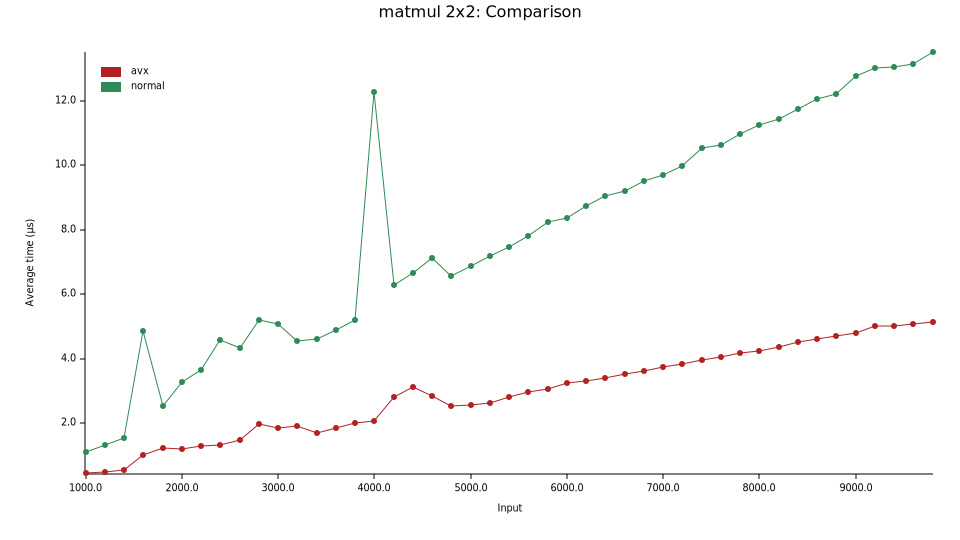
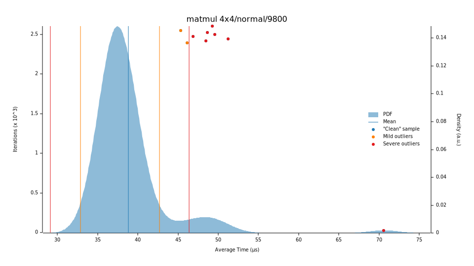

# 矩阵乘法

矩阵运算是SIMD最容易想到的应用，这里实现一下2x2和4x4的矩阵乘法，小试牛刀。


## 2x2矩阵

在这里2x2矩阵用4个双精度浮点数来表示，可以直接用`__m256d`来表示——低位两个分量为第一行，高位两个分量是第二行。


就相当于：

```text
┌───────────────┬───────────────┬───────────────┬───────────────┐ 
│       d       │       c       │       b       │       a       │
└───────────────┴───────────────┴───────────────┴───────────────┘ 
                                *
┌───────────────┬───────────────┬───────────────┬───────────────┐ 
│       t       │       z       │       y       │       x       │
└───────────────┴───────────────┴───────────────┴───────────────┘ 
                                =
┌───────────────┬───────────────┬───────────────┬───────────────┐ 
│    c*x+d*t    │    c*x+d*z    │    a*y+b*t    │    a*x+b*z    │
└───────────────┴───────────────┴───────────────┴───────────────┘                              
```

其实我没找到最优的用SIMD实现2x2矩阵的方法，不过我觉得我自己实现的方法还是挺直观的。

1. 从`[[a, b], [c, d]]` 得到 `[[a, a], [c, c]]` 和 `[[b, b], [d, d]]`（把列各复制一份）
2. 从`[[x, y], [z, t]]`得到`[[x, y], [x, y]]`和`[[z, t], [z, t]]`（把行各复制一份）
3. 把`[[a, a], [c, c]]` 与`[[x, y], [x, y]]`对应分量相乘得到`[[a*x, a*y], [c*x, c*y]]`
4. 把`[[b, b], [d, d]]` 与`[[z, t], [z, t]]`对应分量相乘得到`[[b*z, b*t], [d*z, d*t]]`
5. 然后把3和4的结果加起来。

其实这就是矩阵分块再相乘：


代码写起来就是：

```rust
#[derive(Clone, Copy)]
#[repr(transparent)]
pub struct Matrix2x2(__m256d);

impl Mul for Matrix2x2 {
    type Output = Self;

    #[inline(always)]
    fn mul(self, rhs: Self) -> Self::Output {
        unsafe {
            // [[a, b], [c, d]] -> [[a, a], [c, c]]
            let a_row1_dup = _mm256_permute4x64_pd::<0xA0>(self.0);
            // [[a, b], [c, d]] -> [[b, b], [d, d]]
            let a_row2_dup = _mm256_permute4x64_pd::<0xF5>(self.0);

            // [[x, y], [z, t]] -> [[x, y], [x, y]]
            let b_col1_dup = _mm256_permute4x64_pd::<0x44>(rhs.0);
            // [[x, y], [z, t]] -> [[z, t], [z, t]]
            let b_col2_dup = _mm256_permute4x64_pd::<0xEE>(rhs.0);

            let mut res = _mm256_mul_pd(a_row2_dup, b_col2_dup);
			
            // 这里用fmadd把3/5步骤合并
            res = _mm256_fmadd_pd(a_row1_dup, b_col1_dup, res);

            Self(res)
        }
    }
}
```


做了个bench，处理器是11th Gen Intel(R) Core(TM) i7-1185G7 @ 3.00GHz


1. 500~4900次矩阵乘法（忘记是左闭右开区间，就没做5000次乘法的测试），SIMD与普通的乘法比较（平均时间）

   

2. 4900次矩阵乘法多次采样，SIMD的矩阵乘法平均时间为**5.1721µs**，普通矩阵乘法平均为**13.463 µs** 

   

   

   

## 4x4矩阵

我们用`__m256d`表示4x4矩阵的一行，用`[__m256d; 4]`表示一个4x4矩阵。同样用分块矩阵的方式看一下4x4矩阵的乘法，关注第一行是怎么得出来的：


这一行换成代码来表达就是：


```rust
// c0 = [a00, a00, a00, a00] * [b00, b01, b02, b03]
let mut c0 = _mm256_mul_pd(_mm256_broadcast_sd(&a[0][0]), b[0]);
//    + [a01, a01, a01, a01] * [b10, b11, b12, b13]
c0 = _mm256_fmadd_pd(_mm256_broadcast_sd(&a[0][1]), b[1], c0);
//    + [a02, a02, a02, a02] * [b20, b21, b22, b23]
c0 = _mm256_fmadd_pd(_mm256_broadcast_sd(&a[0][2]), b[2], c0);
//    + [a03, a03, a03, a03] * [b30, b31, b32, b33]
c0 = _mm256_fmadd_pd(_mm256_broadcast_sd(&a[0][3]), b[3], c0);
```

然后其他几行照着写就OK。不过我也还是不太清楚SIMD写4x4矩阵最佳写法是啥。


同样做一下bench，处理器是11th Gen Intel(R) Core(TM) i7-1185G7 @ 3.00GHz

1. 500~4900次矩阵乘法，SIMD与普通的乘法比较（平均时间）——可以看到其实4x4矩阵其实没有2x2矩阵加速效果明显的

   

2. 4900次矩阵乘法多次采样，SIMD的矩阵乘法平均时间为**19.751 µs**，普通矩阵乘法平均为**39.845 µs** 

   

   

