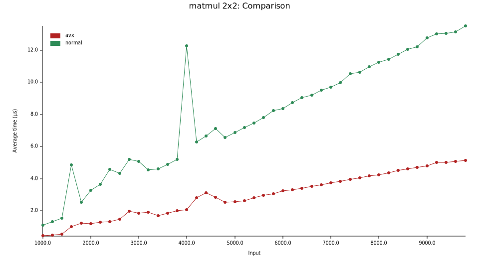
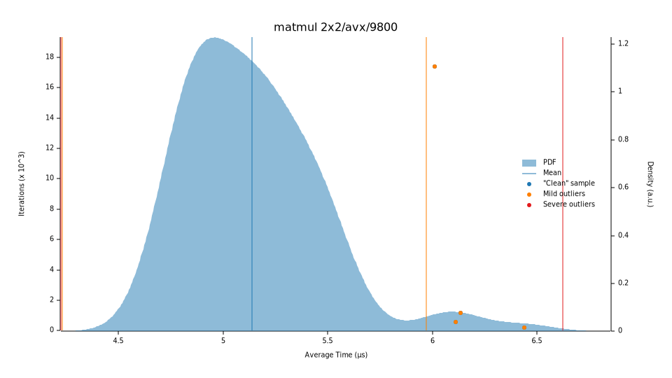
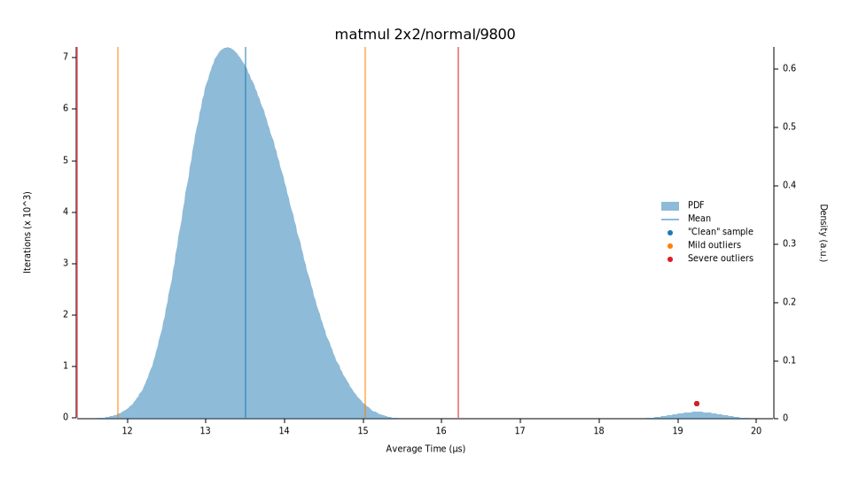
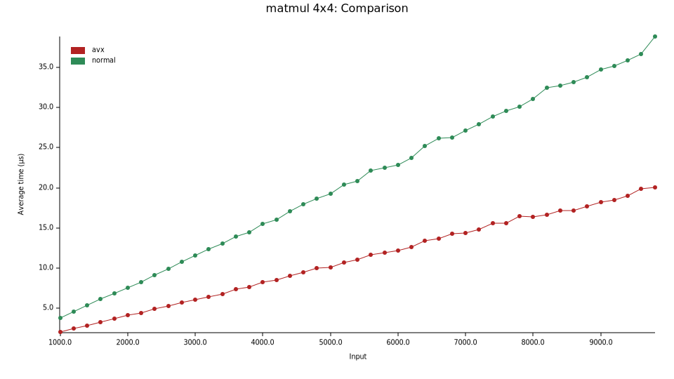
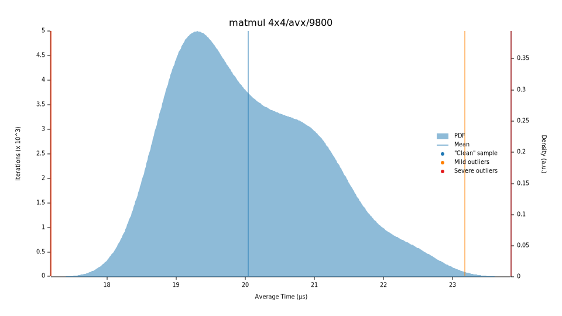
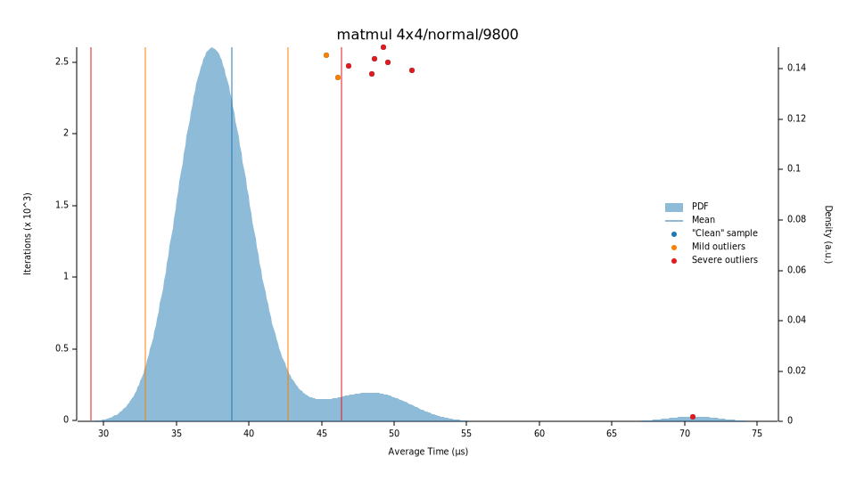
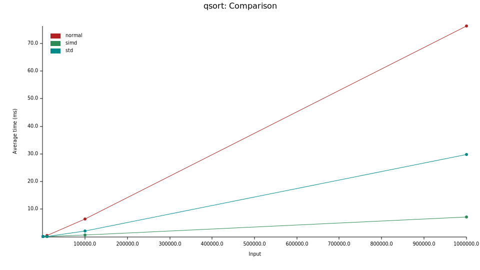

# 近来学点SIMD如何？

之前听说过SIMD，但一直并没有实操过。这几天心血来潮稍微了解了下，感觉开拓了一个新的世界，像在我脑海里建立了一种新的编程模式。

于是在这里记录一波我最近关于SIMD的所学所想。


# SIMD简单介绍

SIMD是Single Instruction, Multiple Data的缩写，是现代CPU提供的一种同时（*单条指令*）对多个数据进行操作的指令。如果说以前的指令提供的是**标量计算**的能力，那么SIMD提供的就是**向量计算**的能力。

（还想补充一点的是，SIMD和超标量两种CPU能力是相互独立的，也就是说，SIMD的指令本身也可以像普通的标量计算的指令一样可以并行执行）


目前两个主流的架构都提供了SIMD指令：

* x86: XMM, SSE, AVX
* arm: neon, SVE
* wasm: simd128


我手头的电脑是11th Gen Intel(R) Core(TM) i7-1185G7 @ 3.00GHz（Tiger lake架构），所以后面便用x86中提供的SIMD指令来实现一些算法。

至于为什么要自己写SIMD代码、直接使用CPU提供的SIMD的intrinsic呢？主要有几个原因：

1. 目前大部分语言并没有对向量计算的抽象的能力，需要自己调用不同平台提供的SIMD函数（甚至自己写汇编）。

2. 编译器的自动向量化实在不够聪明（不过这也和语言本身没有类似特性有关），就算已经把代码写得十分“向量化”了，但生成的代码还是无法完全利用起SIMD的特性：

   ```c
   for (int i = 0; i < N; i+=8) {
       sum += A[i];
       sum += A[i+1];
       sum += A[i+2];
       sum += A[i+3];
       sum += A[i+4];
       sum += A[i+5];
       sum += A[i+6];
       sum += A[i+7];
   }
   ```

   理论上循环体里只要编译成`vaddps  (%rax), %ymm0, %ymm0`，就可以对八个加法一块完成，但gcc -O3愣是编译成了（并没有向量化）：

   ```assembly
           # vaddss是AVX里的标量加法，只把寄存器低位的值相加
           vaddss  (%rax), %xmm0, %xmm0
           vaddss  4(%rax), %xmm0, %xmm0
           vaddss  8(%rax), %xmm0, %xmm0
           vaddss  12(%rax), %xmm0, %xmm0
           vaddss  16(%rax), %xmm0, %xmm0
           vaddss  20(%rax), %xmm0, %xmm0
           vaddss  24(%rax), %xmm0, %xmm0
           vaddss  28(%rax), %xmm0, %xmm0
   ```

3. 各个平台的提供的SIMD指令都不一样（甚至单个平台内不同的SIMD指令集都不一样），几乎没有一套既通用、包含所有功能且有性能保证的可移植的SIMD接口使用。


# x86 SIMD基础

* [Crunching Numbers with AVX and AVX2](https://www.codeproject.com/Articles/874396/Crunching-Numbers-with-AVX-and-AVX)

* [SIMD and vectorization using AVX intrinsic functions (Tutorial)](https://www.youtube.com/watch?v=AT5nuQQO96o)

## 指令集

首先简单过一下x86下SIMD的指令集都提供了什么功能：

1. mmx:
   * 引入了8个64bits的寄存器，可以表示2个32位整数，4个16位整数或者8个8位整数
   * 仅提供整数的向量计算
   * 1997年提出，Intel奔腾2之后开始支持，AMD在K6后支持
2. SSE(SSE, SSE2, SSE3, SSE4):
   * 引入了16个128bits的寄存器（32位机器上只有8个），可以表示4个单精度浮点数（SSE1）；2个双精度浮点数，2个64位整数，4个32位整数，8个16位整数，16个8位整数（SSE2）。
   * 浮点和整数的向量运算都支持，
   * 1999年提出，Intel奔腾3之后开始支持，AMD在速龙XP后支持。SSE2在2001年提出，SSE2在01年，SSE3在04年，SSE4在06年。
3. AVX(AVX, AVX2, AVX512):
   * AVX引入了16个256bits的寄存器（32位机器上只有8个），AVX512则引入了32个512bits的寄存器和8个opmask寄存器。其中在AVX中，只能存浮点数，而在AVX2后则都支持整数。
   * 浮点和整数的向量运算都支持。而在AVX512还支持了mask运算，有了功能完整的permute操作blahblah。
   * AVX在08年提出（第一代酷睿开始支持），AVX2在13年提出（第四代酷睿开始），AVX512在16年提出（第六代酷睿~第十一代酷睿，十二代之后就不支持了。。。反倒zen4还支持）。


说实话，我觉得AVX512才是满血的AVX指令，但可惜十二代酷睿就不支持了。。。之前的permute操作只能以128bits为单位来做；没有mask_xx操作，没法很方便单独操作向量里的其中某部分；AVX512还支持神器compressstore/expendload操作，可以把向量“部分”写到内存里，或者是“部分”读到寄存器里，可以避免越界。

（另外之前AVX512指令带来的CPU降频的问题，在十代酷睿之后就解决了）


## SIMD intrinsic

我们当然可以直接手写SIMD的汇编指令，但没必要。编译器提供了一些几乎能直接映射到汇编的intrinsic函数，抽象层次稍微高一点，比如我们不用关心寄存器如何分配。

我们在C里只要`#include<immintrin.h>`就可以使用所有的SIMD intrinsic函数了。在rust中，x86的intrinsic函数则放在`core::arch::x86_64`中（都假定是64位系统了）。

### 数据类型

目前x86(x86-64)下的SIMD数据类型有以下这些，都对应着对应位数的寄存器：

* `__m64`: 表示1个64位整数，2个32位整数，4个16位整数或8个8位整数
* `__m128`: 表示4个单精度浮点数
* `__m128d`: 表示2个双精度浮点数（d是double，双精度的意思）
* `__m128i`：2个64位整数，4个32位整数，8个16位整数，16个8位整数。（i是integer，整数的意思）
* `__m256`: 表示8个单精度浮点数
* `__m256d`: 表示4个双精度浮点数
* `__m256i`: 4个64位整数blahblah...
* `__m512`, `__m512d`, `__m512i`: 同理
* `__m128bh`, `__m256bh`, `__m512bh`: 半精度浮点数的SIMD类型（bh是brain floating point）

比如说`__m256`的内存布局和`float[8]`或者说`[f32;8]`是一致的（只是对齐不一样），长这样，其中每个格子是为32位，为单精度浮点数：

```text
 ┌───────┬───────┬───────┬───────┬───────┬───────┬───────┬───────┐ 
 │  a7   │  a6   │  a5   │  a4   │  a3   │  a2   │  a1   │  a0   │ 
 └───────┴───────┴───────┴───────┴───────┴───────┴───────┴───────┘ 
     7       6       5       4       3       2       1       0   
```

为了方便与整数的高低位对应，这里也把低位放在右边。（一般书写顺序整数的位数由低到高也是从右到左，有点rtl文字的意味了）


注意，`__m128`的对齐为16个字节，`__m256`对齐为32个字节，`__m512`对齐为64个字节，而`malloc`函数分配的内存则按`size_t`的对齐（一般为8字节），所以如果要分配这些类型的内存则需要`aligned_alloc`函数。


### 函数

所有的intrinsic函数可以在 [Intel Intrinsics Guide](https://www.intel.com/content/www/us/en/docs/intrinsics-guide/index.html)查到，不过你会看到一大堆长这样的函数`_mm256_add_epi32`, `_mm256_cvtepi32_ps`，第一眼会很懵逼。但这里的大多数函数都遵循一个命名规则：`_mm<bit_width>_<op_name>_<data_ty>`

1. bit_width：表示这个函数作用在多少位的向量上，比如`_mm256`则表示作用于256位的向量上。如果没标则默认是128位的。
2. op_name：则是操作的名字，比如说`add`是加，`cvt`是转换，`load`是从内存加载等等。
3. data_ty：表示向量中的数据类型是什么，比如`pd`是双精度浮点，`ps`是单精度浮点，`epi32`是32位有符号整数，`epu64`是64位有符号整数等等。


这些intrinsic函数又可以分为几类：算术类，逻辑类，分量操作类，比较类，转换类，内存读写类，掩码类（AVX512专属）。我们来展开一下。


#### 算术类/逻辑类

算术类和逻辑类属于是最简单典型的操作了，大部分都很好理解，比如`_mm256_mul_ps`就是`__m256`中8个单精度浮点数同时相乘：

```text
 ┌───────┬───────┬───────┬───────┬───────┬───────┬───────┬───────┐ 
 │  a7   │  a6   │  a5   │  a4   │  a3   │  a2   │  a1   │  a0   │   a
 └───────┴───────┴───────┴───────┴───────┴───────┴───────┴───────┘ 
                                 *
 ┌───────┬───────┬───────┬───────┬───────┬───────┬───────┬───────┐ 
 │  b7   │  b6   │  b5   │  b4   │  b3   │  b2   │  b1   │  b0   │   b
 └───────┴───────┴───────┴───────┴───────┴───────┴───────┴───────┘ 
                                 =
 ┌───────┬───────┬───────┬───────┬───────┬───────┬───────┬───────┐ 
 │ a7*b7 │ a6*b6 │ a5*b5 │ a4*b4 │ a3*b3 │ a2*b2 │ a1*b1 │ a0*b0 │  _mm256_mul_ps(a, b)
 └───────┴───────┴───────┴───────┴───────┴───────┴───────┴───────┘ 
```

而`_mm256_and_ps`顾名思义，就是`_mm256_mul_ps`中8个单精度浮点数同时逻辑与了。不过我们可以关注一下这些指令的延迟和吞吐，比如说`_mm256_mul_ps`在Intel Intrinsics guide中上说在Icelake架构中，延迟是4（这里单位我不太清楚），吞吐量（CPI）为0.5——也就是每条指令只需要0.5个指令周期就能完成。


这里额外介绍一个也很常用的运算，融合乘加，一个指令同时完成乘法和加法。比如`_mm256_fmadd_ps`接受三个`__m256`向量`a`, `b`, `c`，每个分量上同时进行`a[i] * b[i] + c[i]`运算：

```text
 ┌───────┬───────┬───────┬───────┬───────┬───────┬───────┬───────┐ 
 │  a7   │  a6   │  a5   │  a4   │  a3   │  a2   │  a1   │  a0   │   a
 └───────┴───────┴───────┴───────┴───────┴───────┴───────┴───────┘ 
                                 *
 ┌───────┬───────┬───────┬───────┬───────┬───────┬───────┬───────┐ 
 │  b7   │  b6   │  b5   │  b4   │  b3   │  b2   │  b1   │  b0   │   b
 └───────┴───────┴───────┴───────┴───────┴───────┴───────┴───────┘ 
                                 +
 ┌───────┬───────┬───────┬───────┬───────┬───────┬───────┬───────┐ 
 │  c7   │  c6   │  c5   │  c4   │  c3   │  c2   │  c1   │  c0   │   c
 └───────┴───────┴───────┴───────┴───────┴───────┴───────┴───────┘ 
                                 =
 ┌───────┬───────┬───────┬───────┬───────┬───────┬───────┬───────┐ 
 │ a7*b7 │ a6*b6 │ a5*b5 │ a4*b4 │ a3*b3 │ a2*b2 │ a1*b1 │ a0*b0 │  _mm256_fmadd_ps(a, b, c)
 │  +c7  │  +c6  │  +c5  │  +c4  │  +c3  │  +c2  │  +c1  │  +c0  │
 └───────┴───────┴───────┴───────┴───────┴───────┴───────┴───────┘ 
```

但其实这和`_mm256_mul_ps`具有同样的延迟和吞吐，而且这是一个操作，会比分别乘完再加少一次舍入误差——会更加精确。


算术类除了加减乘除，其实还有一些数学函数，比如`sqrt`/三角函数啥的（竟然把这些都做进了电路里，真狠啊）。还有一些不是按对应分量的运算，比如说水平加法`hadd`，点乘`dp`等等。这里便不展开了。


#### 分量操作类

分量操作类，顾名思义就是用来操作向量中的分量的，比如说分量位置的移动，分量的读取修改等。这也是SIMD中十分重要的一种运算。其中最常用的操作是`permute`排列操作，排列操作也有很多种。

最通用的排列是`permutexvar`(AVX512引入)操作，比如`_m256_permutexvar_ps`操作，接受一个idx向量，和一个被排列向量，每个分量进行索引操作`a[ix]`操作：

```text
 ┌───────┬───────┬───────┬───────┬───────┬───────┬───────┬───────┐ 
 │  i7   │  i6   │  i5   │  i4   │  i3   │  i2   │  i1   │  i0   │   idx
 └───────┴───────┴───────┴───────┴───────┴───────┴───────┴───────┘ 
                                []
 ┌───────┬───────┬───────┬───────┬───────┬───────┬───────┬───────┐ 
 │  a7   │  a6   │  a5   │  a4   │  a3   │  a2   │  a1   │  a0   │   a
 └───────┴───────┴───────┴───────┴───────┴───────┴───────┴───────┘ 
                                 =
 ┌───────┬───────┬───────┬───────┬───────┬───────┬───────┬───────┐ 
 │ a[i7] │ a[i6] │ a[i5] │ a[i4] │ a[i3] │ a[i2] │ a[i1] │ a[i0] │  _m256_permutexvar_ps(idx, a)
 └───────┴───────┴───────┴───────┴───────┴───────┴───────┴───────┘ 
```

这个在Icelake架构下延迟为3，CPI为1，吞吐量要比乘法加法要低一些。

除了`permutexvar`这些名字里带var的操作（即用向量本身做索引）以外，还有些不带var的`permute`操作，通过一个8位的**常量**来表示索引向量，比如`_mm_permute_ps(a, 0b11_01_01_10)`：

```text
┌───────┬───────┬───────┬───────┐ 
│  a3   │  a2   │  a1   │  a0   │   a
└───────┴───────┴───────┴───────┘ 
   11      01      01       10
┌───────┬───────┬───────┬───────┐ 
│ a[3]  │ a[1]  │ a[1]  │ a[2]  │   _mm_permute_ps(a, 0b11_01_01_10)
└───────┴───────┴───────┴───────┘
```

这个操作在Icelake架构中，延迟只有1，比上面的`permutexvar`快不少。但这种操作挺弱鸡，只能在128位的数据内进行排序——在AVX里有128位的通道（lane）和256位的通道，在一个通道中排列的效率会更高（再补充一点，`permutexvar`里的`x`是across，也就是跨通道的意思）。如果在超过一个128位通道的向量中进行排列，相当于分别对每个128位的部分都进行同样的操作，比如说`_mm256_permute_ps(a, 0b11_01_01_10)`：

```text
┌───────┬───────┬───────┬───────┬───────┬───────┬───────┬───────┐ 
│  a7   │  a6   │  a5   │  a4   │  a3   │  a2   │  a1   │  a0   │   a
└───────┴───────┴───────┴───────┴───────┴───────┴───────┴───────┘ 
                                   11      01      01       10
┌───────┬───────┬───────┬───────┬───────┬───────┬───────┬───────┐ 
│  a[7] │  a[5] │  a[5] │  a[6] │ a[3]  │ a[1]  │ a[1]  │ a[2]  │   _mm256_permute_ps(a, 0b11_01_01_10)
└───────┴───────┴───────┴───────┴───────┴───────┴───────┴───────┘
注意这里下标+4了，也就是0b100
```


除了`permute`以外，还有其它操作，比如`shuffle`/`blend`操作，这里就不一一展开了。


#### 比较类

比较的操作也是比较直观的，就是在每个分量上进行比较，如果为true分量上为全1，为false则分量为0。

举个具体的例子，`_mm256_cmp_ps(a, b, _CMP_LE_UQ)`，其中第三个参数是个常量，表示比较的操作，其中`U`表示不比较`nan`（如果要比较的话用`O`），而`Q`表示quiet（如果关心signal浮点数的话则用`S`）。其它比较运算可以看intel Intrinsics guide。

```text
┌───────┬───────┬───────┬───────┬───────┬───────┬───────┬───────┐ 
│  1.0  │  2.0  │  3.0  │  4.0  │  5.0  │  6.0  │  7.0  │  8.0  │   a
└───────┴───────┴───────┴───────┴───────┴───────┴───────┴───────┘ 
                      _CMP_LE_UQ 也就是 <=
┌───────┬───────┬───────┬───────┬───────┬───────┬───────┬───────┐ 
│  4.0  │  4.0  │  4.0  │  4.0  │  4.0  │  4.0  │  4.0  │  4.0  │   b
└───────┴───────┴───────┴───────┴───────┴───────┴───────┴───────┘ 
                                =
┌───────┬───────┬───────┬───────┬───────┬───────┬───────┬───────┐ 
│  0x0  │  0x0  │  0x0  │  0x0  │0xFFFF │0xFFFF │0xFFFF │0xFFFF │   _mm256_cmp_ps(a, b, _CMP_LE_UQ)
│       │       │       │       │  FFFF │  FFFF │  FFFF │  FFFF │
└───────┴───────┴───────┴───────┴───────┴───────┴───────┴───────┘ 
```


比较运算看起来比较简单，但是如果结合逻辑运算的话，就可以实现类似if-else的效果。举个例子，如果我们想在分量上计算：

```rust
let d = if a <= b {
    a + b
} else {
    a * b
}
```

我们就可以写成这样：

```rust
// 假设结果是这个
// ┌───────┬───────┬───────┬───────┬───────┬───────┬───────┬───────┐ 
// │  true │  true │  true │  true │ false │ false │ false │ false │  
// └───────┴───────┴───────┴───────┴───────┴───────┴───────┴───────┘  
let cmp = _mm256_cmp_ps(a, b, _CMP_LE_UQ);

// 加完后将为false的给置0
// ┌───────┬───────┬───────┬───────┬───────┬───────┬───────┬───────┐ 
// │ a7+b7 │ a6+b6 │ a5+b5 │ a4+b4 │   0   │   0   │   0   │   0   │  
// └───────┴───────┴───────┴───────┴───────┴───────┴───────┴───────┘  
let add = __mm256_and_ps(cmp, _mm256_add_ps(a, b));

// 加完后将为true的置0
// ┌───────┬───────┬───────┬───────┬───────┬───────┬───────┬───────┐ 
// │   0   │   0   │   0   │   0   │ a3*b3 │ a2*b2 │ a1*b1 │ a0*b0 │  
// └───────┴───────┴───────┴───────┴───────┴───────┴───────┴───────┘  
let mul = __mm256_notand_ps(cmp, _mm256_mul_ps(a, b));

// 最后将结果合并
// ┌───────┬───────┬───────┬───────┬───────┬───────┬───────┬───────┐ 
// │ a7+b7 │ a6+b6 │ a5+b5 │ a4+b4 │ a3*b3 │ a2*b2 │ a1*b1 │ a0*b0 │  
// └───────┴───────┴───────┴───────┴───────┴───────┴───────┴───────┘  
let res = __mm256_or_ps(add, mul);
```

虽然这里会产生多余的运算，把不必要计算的分量都计算了一遍，但这里不产生实际的分支，对分支预测十分友好，最终还是快的。

那有没有不进行额外计算的办法呢？有！AVX-512里就引入了这样的方式！


#### 掩码类

AVX512的新指令里引入的掩码的概念，堪称神来之笔，为向量计算的表达力提升了一个台阶。目前分别为8位、16位、32位、64位的掩码`__mask8`, `__mask16`,`__mask32`, `__mask64`。掩码的每一位都映射到向量中的一个分量，一般来说0代表对应分量不参与运算，1代表对应分量参与运算。

比如说`_m256_mask_add_ps`，接受3个向量`src`, `a`, `b`，其中`a`和`b`两个向量参与运算。当掩码对应位为0时，*不*进行运算，取`src`对应位，而当掩码对应位为1时，才进行运算：（注意，这里的掩码并不是常量）

```text
 ┌───────┬───────┬───────┬───────┬───────┬───────┬───────┬───────┐ 
 │  s7   │  s6   │  s5   │  s4   │  s3   │  s2   │  s1   │  s0   │   src
 └───────┴───────┴───────┴───────┴───────┴───────┴───────┴───────┘ 
     1       1       1       1       0       0       0      0        mask = 0b11110000
 ┌───────┬───────┬───────┬───────┬───────┬───────┬───────┬───────┐ 
 │  a7   │  a6   │  a5   │  a4   │  a3   │  a2   │  a1   │  a0   │   a
 └───────┴───────┴───────┴───────┴───────┴───────┴───────┴───────┘ 
                                 +
 ┌───────┬───────┬───────┬───────┬───────┬───────┬───────┬───────┐ 
 │  b7   │  b6   │  b5   │  b4   │  b3   │  b2   │  b1   │  b0   │   b
 └───────┴───────┴───────┴───────┴───────┴───────┴───────┴───────┘ 
                                 =
 ┌───────┬───────┬───────┬───────┬───────┬───────┬───────┬───────┐ 
 │ a7+b7 │ a6+b6 │ a5+b5 │ a4+b4 │  s3   │  s2   │  s1   │  s0   │   _m256_mask_add_ps(src, mask, a, b)
 └───────┴───────┴───────┴───────┴───────┴───────┴───────┴───────┘  
 
 如果想把不参与运算的分量置0，那还能把`mask`换成`maskz`，z就是zero的意思。
```


而AVX512中比较操作也返回一个掩码，而非一整个向量了，照搬之前的例子`_mm256_cmp_ps_mask(a, b, _CMP_LE_UQ)`：

```text
┌───────┬───────┬───────┬───────┬───────┬───────┬───────┬───────┐ 
│  1.0  │  2.0  │  3.0  │  4.0  │  5.0  │  6.0  │  7.0  │  8.0  │   a
└───────┴───────┴───────┴───────┴───────┴───────┴───────┴───────┘ 
                      _CMP_LE_UQ 也就是 <=
┌───────┬───────┬───────┬───────┬───────┬───────┬───────┬───────┐ 
│  4.0  │  4.0  │  4.0  │  4.0  │  4.0  │  4.0  │  4.0  │  4.0  │   b
└───────┴───────┴───────┴───────┴───────┴───────┴───────┴───────┘ 
                                =
    1       1       1       1       0       0       0       0       _mm256_cmp_ps_mask(a, b, _CMP_LE_UQ) = 0b11110000
```

得到的mask又可以放到mask运算中去。我们可以用AVX512来重新写一下刚刚模拟if-else的例子：

```rust
// 0b11110000
let cmp_mask = _mm256_cmp_ps_mask(a, b, _CMP_LE_UQ);

// 只在掩码为1的分量上计算加法
// ┌───────┬───────┬───────┬───────┬───────┬───────┬───────┬───────┐ 
// │ a7+b7 │ a6+b6 │ a5+b5 │ a4+b4 │  a3   │  a2   │  a1   │  a0   │  
// └───────┴───────┴───────┴───────┴───────┴───────┴───────┴───────┘  
let add = __mm256_maskz_add_ps(a, cmp_mask, a, b);

// 在掩码为0的分量上计算乘法
// ┌───────┬───────┬───────┬───────┬───────┬───────┬───────┬───────┐ 
// │ a7+b7 │ a6+b6 │ a5+b5 │ a4+b4 │ a3*b3 │ a2*b2 │ a1*b1 │ a0*b0 │  
// └───────┴───────┴───────┴───────┴───────┴───────┴───────┴───────┘  
let res = __mm256_maskz_mul_ps(add, !cmp_mask, a, b);
```

用上了mask运算之后，除了减少了三次向量逻辑运算，同时一个mask指令里面还减少不必要的运算。


有了掩码操作之后，化简了特别多的操作，在这里就不一一展开了（留一个到内存读写）。**所以说AVX512 YYDS!!!!在此diss一下某牙膏厂**


#### 转换类

这里就展开不介绍了，反正就是分量数据类型的转换，操作名一般为`cvt`。


#### 内存读写类

最后再来展开一下内存读写相关的操作。最基础的读写操作就是`loadu`和`storeu`，从某个地址中读出或写入数据，这里u指的是unaligned，也就是不要求读出和写入的内存是对齐的——因为在新架构中，对不对齐已经不影响效率了。

比如说`__m256 _m256_loadu_ps(float const * mem_addr)`，就是从`mem_addr`的地址开始**连续**读8个float——**注意：这里要求这篇连续的内存区域是合法的，否则就是UB**。`_m256_storeu_ps`也类似。

不过很多时候，申请的内存并不都是16, 32, 64bytes的倍数，不一定能很好地被向量所“覆盖”，于是当我们想读入或者写入剩下几个字节的时候就会很麻烦（就得逐个读到向量中）。那有什么办法呢——**答案还是AVX512！** AVX512提供了两个神操作`expendloadu`和`compressstoreu`，搭配掩码就可以做到内存按向量分量部分读入和写入。

举个例子：

```rust
// 这里只有7个f32，不能直接load到_m256中
let mut arr: [f32; 7] = array_fn(|i| i as f32);

// 但我们可以通过expendloadu只读低位7个f32到向量中，剩下一个分量置为0
// ┌───────┬───────┬───────┬───────┬───────┬───────┬───────┬───────┐ 
// │  0.0  │  6.0  │  5.0  │  4.0  │  3.0  │  2.0  │  1.0  │  0.0  │   v
// └───────┴───────┴───────┴───────┴───────┴───────┴───────┴───────┘ 
let v = _m256_maskz_expandloadu_ps(0b01111111, addr_of!(arr).cast());

// 只将向量中7个数（除了第5个分量）写入`arr`中
// ┌───────┬───────┬───────┬───────┬───────┬───────┬───────┐ 
// │  0.0  │  6.0  │  5.0  │  3.0  │  2.0  │  1.0  │  0.0  │   arr
// └───────┴───────┴───────┴───────┴───────┴───────┴───────┘ 
_m256_mask_compressstoreu_ps(addr_mut_of!(arr).cast(), 0b11101111, v);


```


除了`load`和`store`，还介绍几个：

1. `broadcast`操作，把所有分量都置为一个值（参数）
2. `insert`操作，当然也可以直接`a[i] = x`
3. `extract`操作，也可以直接通过`a[i]`读
4. `gather`操作，可以离散地读内存里的值，但不太好用。


最后还要注意一点，这些内存读写操作都还是蛮贵的，比如一个`_mm256_loadu_ps`在Icelake架构里延迟都要去到8——所以尽量还是减少内存的读写，更多地使用SIMD给的类型。


# 算法

介绍完一些比较基础的操作之后，这里给几个简单的可以用SIMD来表达的算法。

详细代码可以在[这里](https://github.com/TOETOE55/simd_demo)找到。


## 矩阵乘法

矩阵运算是SIMD最容易想到的应用，这里实现一下2x2和4x4的矩阵乘法，小试牛刀。


### 2x2矩阵

在这里2x2矩阵用4个双精度浮点数来表示，可以直接用`__m256d`来表示——低位两个分量为第一行，高位两个分量是第二行。
$$
\left(
\begin{matrix}
 a & b \\
 c & d 
\end{matrix}
\right)

\left(
\begin{matrix}
 x & y \\
 z & t 
\end{matrix}
\right)

=

\left(
\begin{matrix}
 ax+bz & ay+bt \\
 cx+dz & cy+dt 
\end{matrix}
\right)
$$
就相当于：

```text
┌───────────────┬───────────────┬───────────────┬───────────────┐ 
│       d       │       c       │       b       │       a       │
└───────────────┴───────────────┴───────────────┴───────────────┘ 
                                *
┌───────────────┬───────────────┬───────────────┬───────────────┐ 
│       t       │       z       │       y       │       x       │
└───────────────┴───────────────┴───────────────┴───────────────┘ 
                                =
┌───────────────┬───────────────┬───────────────┬───────────────┐ 
│    c*x+d*t    │    c*x+d*z    │    a*y+b*t    │    a*x+b*z    │
└───────────────┴───────────────┴───────────────┴───────────────┘                              
```

其实我没找到最优的用SIMD实现2x2矩阵的方法，不过我觉得我自己实现的方法还是挺直观的。

1. 从`[[a, b], [c, d]]` 得到 `[[a, a], [c, c]]` 和 `[[b, b], [d, d]]`（把列各复制一份）
2. 从`[[x, y], [z, t]]`得到`[[x, y], [x, y]]`和`[[z, t], [z, t]]`（把行各复制一份）
3.  把`[[a, a], [c, c]]` 与`[[x, y], [x, y]]`对应分量相乘得到`[[a*x, a*y], [c*x, c*y]]`
4. 把`[[b, b], [d, d]]` 与`[[z, t], [z, t]]`对应分量相乘得到`[[b*z, b*t], [d*z, d*t]]`
5. 然后把3和4的结果加起来。

其实这就是矩阵分块再相乘：
$$
\left(
\begin{matrix}
\begin{array}{c|c}
 a & b \\
 c & d 
\end{array}
\end{matrix}
\right)

\left(
\begin{matrix}
 x & y \\ \hline
 z & t 
\end{matrix}
\right)

=

\left(
\begin{matrix}
 a \\
 c
\end{matrix}
\right)

(
\begin{matrix}
 x & y 
\end{matrix}
)

+

\left(
\begin{matrix}
 b \\
 d
\end{matrix}
\right)

(
\begin{matrix}
 z & t 
\end{matrix}
)
$$
代码写起来就是：

```rust
#[derive(Clone, Copy)]
#[repr(transparent)]
pub struct Matrix2x2(__m256d);

impl Mul for Matrix2x2 {
    type Output = Self;

    #[inline(always)]
    fn mul(self, rhs: Self) -> Self::Output {
        unsafe {
            // [[a, b], [c, d]] -> [[a, a], [c, c]]
            let a_row1_dup = _mm256_permute4x64_pd::<0xA0>(self.0);
            // [[a, b], [c, d]] -> [[b, b], [d, d]]
            let a_row2_dup = _mm256_permute4x64_pd::<0xF5>(self.0);

            // [[x, y], [z, t]] -> [[x, y], [x, y]]
            let b_col1_dup = _mm256_permute4x64_pd::<0x44>(rhs.0);
            // [[x, y], [z, t]] -> [[z, t], [z, t]]
            let b_col2_dup = _mm256_permute4x64_pd::<0xEE>(rhs.0);

            let mut res = _mm256_mul_pd(a_row2_dup, b_col2_dup);
			
            // 这里用fmadd把3/5步骤合并
            res = _mm256_fmadd_pd(a_row1_dup, b_col1_dup, res);

            Self(res)
        }
    }
}
```


做了个bench，处理器是11th Gen Intel(R) Core(TM) i7-1185G7 @ 3.00GHz


1. 500~4900次矩阵乘法（忘记是左闭右开区间，就没做5000次乘法的测试），SIMD与普通的乘法比较（平均时间）

   

2. 4900次矩阵乘法多次采样，SIMD的矩阵乘法平均时间为**5.1721µs**，普通矩阵乘法平均为**13.463 µs** 

   

   

   


### 4x4矩阵

我们用`__m256d`表示4x4矩阵的一行，用`[__m256d; 4]`表示一个4x4矩阵。同样用分块矩阵的方式看一下4x4矩阵的乘法，关注第一行是怎么得出来的：
$$
\begin{align}

&
\left(
\begin{matrix}
\begin{array}{c|c}
 a_{00} & a_{01} & a_{02} & a_{03} \\
 a_{10} & a_{11} & a_{12} & a_{13} \\
 a_{20} & a_{21} & a_{22} & a_{23} \\
 a_{30} & a_{31} & a_{32} & a_{33} \\
\end{array}
\end{matrix}
\right)

\left(
\begin{matrix}
 b_{00} & b_{01} & b_{02} & b_{03} \\ \hline
 b_{10} & b_{11} & b_{12} & b_{13} \\ \hline
 b_{20} & b_{21} & b_{22} & b_{23} \\ \hline
 b_{30} & b_{31} & b_{32} & b_{33} 
\end{matrix}
\right)

\\

= &

\left(
\begin{matrix}
\textcolor{red}{a_{00}} \\
a_{10} \\
a_{20} \\
a_{30} \\
\end{matrix}
\right)

\textcolor{red}{
\left(
\begin{matrix}
 b_{00} & b_{01} & b_{02} & b_{03}
\end{matrix}
\right)
}

+ 
\left(
\begin{matrix}
\textcolor{red}{a_{01}} \\
a_{11} \\
a_{21} \\
a_{31} \\
\end{matrix}
\right)

\textcolor{red}{
\left(
\begin{matrix}
 b_{10} & b_{11} & b_{12} & b_{13}
\end{matrix}
\right)
}

\\
+ &

\left(
\begin{matrix}
\textcolor{red}{a_{02}} \\
a_{12} \\
a_{22} \\
a_{32} \\
\end{matrix}
\right)

\textcolor{red}{
\left(
\begin{matrix}
 b_{20} & b_{21} & b_{22} & b_{23}
\end{matrix}
\right)
}

+ 
\left(
\begin{matrix}
\textcolor{red}{a_{03}} \\
a_{13} \\
a_{23} \\
a_{33} \\
\end{matrix}
\right)

\textcolor{red}{
\left(
\begin{matrix}
 b_{30} & b_{31} & b_{32} & b_{33} 
\end{matrix}
\right)
}

\end{align}
$$

这一行换成代码来表达就是：


```rust
// c0 = [a00, a00, a00, a00] * [b00, b01, b02, b03]
let mut c0 = _mm256_mul_pd(_mm256_broadcast_sd(&a[0][0]), b[0]);
//    + [a01, a01, a01, a01] * [b10, b11, b12, b13]
c0 = _mm256_fmadd_pd(_mm256_broadcast_sd(&a[0][1]), b[1], c0);
//    + [a02, a02, a02, a02] * [b20, b21, b22, b23]
c0 = _mm256_fmadd_pd(_mm256_broadcast_sd(&a[0][2]), b[2], c0);
//    + [a03, a03, a03, a03] * [b30, b31, b32, b33]
c0 = _mm256_fmadd_pd(_mm256_broadcast_sd(&a[0][3]), b[3], c0);
```

然后其他几行照着写就OK。不过我也还是不太清楚SIMD写4x4矩阵最佳写法是啥。


同样做一下bench，处理器是11th Gen Intel(R) Core(TM) i7-1185G7 @ 3.00GHz

1. 500~4900次矩阵乘法，SIMD与普通的乘法比较（平均时间）——可以看到其实4x4矩阵其实没有2x2矩阵加速效果明显的

   

2. 4900次矩阵乘法多次采样，SIMD的矩阵乘法平均时间为**19.751 µs**，普通矩阵乘法平均为**39.845 µs** 

   

   


## parse number

第二个SIMD的发力点是decode/encode相关，比如base64/utf8，这方面有很多库。不过我觉得这里面最有意思的是simdjson，于是这里介绍一下，simdjson中的number parsing的部分，整数的parsing（simdjson的作者又在他的[博客](https://lemire.me/blog/2022/05/25/parsing-json-faster-with-intel-AVX-512/)里用AVX512优化了这部分工作）：

算法分成几部分：

1. 将字符串按字节读入到向量中，大于20bytes直接返回失败（`u64::MAX == 1844_67440737_09551615` 用字符串表示为20个字节）
2. 将向量中对应数字的有效位的分量减去`'0'`
3. 将向量中有效位的分量与9比较，如果存在>9的返回失败（说明字符串中存在非数字）
4. 通过向量计算尽可能累加结果，比如说`[1, 2, 3, 4, 5, 6, 7, 8, 9]`
   1. 每两个分量计算`a + 10*b`，得到`[1, 23, 45, 67, 89]`
   2. 每两个分量计算`a + 100*b`，得到`[1, 2345, 6789]`
   3. 每两个分量计算`a + 10000*b`，得到`[1, 23456789]`
5. 通过标量计算累加剩余结果，比如上面的`1*1_0000_0000 + 23456789`

前三步可以使用AVX512指令来优化：

```rust
let bytes = s.as_bytes();

// 超过20字节的字符串超过u64的范围
if bytes.len() > 20 {
    return None;
}

let start = bytes.as_ptr();
let end = unsafe { start.offset(bytes.len() as isize) };
let mask = 0xFFFFFFFF_u32 << (32 - s.len());

let base10_8bit = unsafe {
    let ascii_zero = _mm256_set1_epi8('0' as i8);
    let nine = _mm256_set1_epi8(9);

    // 1. 将字符串读入到向量的高位中，向量低位置为0
    //    *注意*：
    //    - `__m256i` 可以表示32个 `u8`
    //    - 字符串的高低位与数字的高低位是相反的
    let s_bytes_v = _mm256_maskz_loadu_epi8(mask, end.offset(-32).cast());

    // 2. 将向量读到的字符串部分，每个字节 - '0'
    let base10_8bit = _mm256_maskz_sub_epi8(mask, s_bytes_v, ascii_zero);

    // 3. 如果存在字节 > 9的，说明存在非数字的字节
    //    *注意*: 这里按u8解释i8，所以如果是负数，也会 > 9
    let nondigits = _mm256_mask_cmpgt_epu8_mask(mask, base10_8bit, nine);
    if nondigits == 0 {
        return None;
    }

    base10_8bit
};
```


然后使用向量运算进行累加，这里要用到`madd`类操作——纵向乘横向加（不过支持的位数不多）：

```rust
// 使用向量计算10进制求和
// 最后得到8位(digits)整数向量(4x32bits)
//
let base10e8_32bit = unsafe {
    let digit_value_base10_8bit = _mm256_set_epi8(
        1, 10, 1, 10, 1, 10, 1, 10, 1, 10, 1, 10, 1, 10, 1, 10, 1, 10, 1, 10, 1, 10, 1, 10, 1,
        10, 1, 10, 1, 10, 1, 10,
    );
    let digit_value_base10e2_8bit = _mm_set_epi8(
        1, 100, 1, 100, 1, 100, 1, 100, 1, 100, 1, 100, 1, 100, 1, 100,
    );
    let digit_value_base10e4_16bit = _mm_set_epi16(1, 10000, 1, 10000, 1, 10000, 1, 10000);

    // example:
    // s = "1234"
    // base10_8bit             = [0.., 1, 2, 3, 4]
    // digit_value_base10_8bit = [.., 10, 1, 10, 1]
    // maddubs_epi16           = [0.., 1*10 + 2*1, 3*10 + 4*1]
    //                         = [0.., 12, 34]
    let base10e2_16bit = _mm256_maddubs_epi16(base10_8bit, digit_value_base10_8bit);
    let base10e2_8bit = _mm256_cvtepi16_epi8(base10e2_16bit);

    // = [0.., 1234]
    let base10e4_16bit = _mm_maddubs_epi16(base10e2_8bit, digit_value_base10e2_8bit);

    let base10e8_32bit = _mm_madd_epi16(base10e4_16bit, digit_value_base10e4_16bit);
    base10e8_32bit
};
```


最后剩余的累加通过标量加法完成：

```rust
// 使用标量计算剩余数的十进制求和
unsafe {
    let res_1digit = _mm_extract_epi32(base10e8_32bit, 3) as u64;
    if mask & 0xFFFFFFFF == 0 {
        return Some(res_1digit);
    }

    let middle_part = _mm_extract_epi32(base10e8_32bit, 2) as u64;
    let res_2digit = res_1digit + 1_0000_0000 * middle_part;
    if mask & 0xFFFF == 0 {
        return Some(res_2digit);
    }

    let high_part = _mm_extract_epi32(base10e8_32bit, 1) as u64;
    if high_part > 1844 || res_2digit > 67440737_09551615 {
        return None;
    } else {
        return Some(res_2digit + 1_0000_0000_0000_0000 * high_part);
    }
}
```


### bench

处理器是11th Gen Intel(R) Core(TM) i7-1185G7 @ 3.00GHz。处理1000000个随机u64的parse，速度比标准库提升了两倍多。

|        | 平均耗时  | 处理速度   |
| ------ | --------- | ---------- |
| simd   | 10.900 ms | 1.657 GB/s |
| normal | 30.463 ms | 0.593 GB/s |
| std    | 23.778 ms | 0.760 GB/s |


simdjson其实我还没仔细看，这里就不展开了，大家可以直接去看simdjson的[仓库](https://github.com/simdjson/simdjson)，算法相关的资料也都非常齐全。

## 快排

SIMD还有一个让我觉得意想不到的能力是，可以用来做排序。[这篇论文](https://arxiv.org/pdf/1704.08579)提出了一种基于AVX512指令的快排优化算法。

该论文提出快排有两个开销最大的部分：

1. partition部分，也就是把比基准小的放基准左边，把基准大的放基准右边——这是快排N*lg(N)前面那个一次的N的来源。
2. 短数组排序——当快排划分到小的区间进行排序的时候。


### partition

论文提出了新的partition算法，它利用了SIMD批量读出写入、批量比较的能力，尤其是AVX512中的`cmp_mask`和`compressstore`运算。这里就详细介绍一下这个算法。

1. 首先是，`simd_partition`接口，选取`arr`最后一个元素为基准，函数将`arr`中小于等于基准的元素放在左边，大于基准的元素放在右边，而函数的返回值是右边的第一个元素的下标（也就是第一个比基准大的元素）。要求数组的长度大于等于两倍的向量长度。

   ```rust
   fn simd_partition(arr: &mut [i32]) -> usize;
   ```

2. 这个算法主要维护几个下标：

   - `left`：从0开始，递增步长一般为向量的长度，直到`left == right`，用于批量读入数组的值。
   - `right`：从len - 1开始，递减步长一般为向量的长度，直到`left == right`，用于批量读入数组的值。
   - `left_w`：从0开始递增，直到`left_w == right_w`，用于写入从`left`或者`right`中读到小于等于基准的值，每次递增保证`left_w`左边的值小于等于基准。
   - `right_w`：从len - 1开始递减，直到`left_w == right_w`，用于写入从`left`或者`right`中读到大于基准的值，每次递增保证`right_w`右边的值大于基准。

算法的详细代码

```rust
/// 向量长度，这里为 16
const S: usize = size_of::<__m512i>() / size_of::<i32>();

/// Safety
/// - arr.len() > 2*S
unsafe fn simd_partition(arr: &mut [i32]) -> usize {
    let mut left = 0;
    let mut right = arr.len() - 1;
    unsafe {
        // 基准向量
        let pivotvec = _mm512_set1_epi32(arr[right]);

        // 1. 读出第一个向量和最后一个向量的值，并推进`left`和`right`。这两个向量做特殊处理。
        let left_val = _mm512_loadu_epi32(arr.as_ptr().offset(left as isize));
        let mut left_w = left;
        left += S;

        let mut right_w = right;
        right -= S;
        let right_val = _mm512_loadu_epi32(arr.as_ptr().offset(right as isize));

        // 2. 让`left`和`right`尽可能以一个向量长度的步长向中间推进。
        while left + S <= right {
            let val;
            // 从`left`或`right`中读出一个向量，并推进
            if left - left_w <= right_w - right {
                val = _mm512_loadu_epi32(arr.as_ptr().offset(left as isize));
                left += S;
            } else {
                right -= S;
                val = _mm512_loadu_epi32(arr.as_ptr().offset(right as isize));
            }

            // 将读出的值批量与基准比较
            let mask = _mm512_cmp_epi32_mask::<_MM_CMPINT_LE>(val, pivotvec);

            // 小于等于基准值的个数
            let nb_low = mask.count_ones() as usize;
            // 大于等于基准值的个数
            let nb_high = S - nb_low;

            // 将小于等于基准的部分写到`left_w`中，并推进`left_w`
            _mm512_mask_compressstoreu_epi32(
                arr.as_mut_ptr().offset(left_w as isize) as *mut i32 as _,
                mask,
                val,
            );
            left_w += nb_low;

            // 将大于基准的部分写到`right_w`中，并推进`right_w`
            right_w -= nb_high;
            _mm512_mask_compressstoreu_epi32(
                arr.as_mut_ptr().offset(right_w as isize) as *mut i32 as _,
                !mask,
                val,
            );
        }

        // 3. 处理当`left`与`right`之间不足一个向量长度的情况
        {
            let remaining = right - left;
            let val = _mm512_loadu_epi32(arr.as_ptr().offset(left as isize));
            // left = right;

            let mask = _mm512_cmp_epi32_mask::<_MM_CMPINT_LE>(val, pivotvec);

            // 只关心`left`和`right`之间的数据
            let mask_low = mask & !(0xFFFF << remaining);
            let mask_high = !mask & !(0xFFFF << remaining);

            // 下面处理同上
            let nb_low = mask_low.count_ones() as usize;
            let nb_high = mask_high.count_ones() as usize;

            _mm512_mask_compressstoreu_epi32(
                arr.as_mut_ptr().offset(left_w as isize) as *mut i32 as _,
                mask_low,
                val,
            );
            left_w += nb_low;

            right_w -= nb_high;
            _mm512_mask_compressstoreu_epi32(
                arr.as_mut_ptr().offset(right_w as isize) as *mut i32 as _,
                mask_high,
                val,
            );
        }
        
        // 4. 再处理一开始没有用于比较的一个向量和最后一个向量（处理方法一致）
        {
            let mask = _mm512_cmp_epi32_mask::<_MM_CMPINT_LE>(left_val, pivotvec);

            let nb_low = mask.count_ones() as usize;
            let nb_high = S - nb_low;

            _mm512_mask_compressstoreu_epi32(
                arr.as_mut_ptr().offset(left_w as isize) as *mut i32 as _,
                mask,
                left_val,
            );
            left_w += nb_low;

            right_w -= nb_high;
            _mm512_mask_compressstoreu_epi32(
                arr.as_mut_ptr().offset(right_w as isize) as *mut i32 as _,
                !mask,
                left_val,
            );
        }
        {
            let mask = _mm512_cmp_epi32_mask::<_MM_CMPINT_LE>(right_val, pivotvec);

            let nb_low = mask.count_ones() as usize;
            let nb_high = S - nb_low;

            _mm512_mask_compressstoreu_epi32(
                arr.as_mut_ptr().offset(left_w as isize) as *mut i32 as _,
                mask,
                right_val,
            );
            left_w += nb_low;

            right_w -= nb_high;
            _mm512_mask_compressstoreu_epi32(
                arr.as_mut_ptr().offset(right_w as isize) as *mut i32 as _,
                !mask,
                right_val,
            );
        }
        
        // assert_eq!(left_w, right_w);
        arr.swap(left_w, arr.len() - 1);
        left_w
    }
}
```


这里用一个实际的例子做一下演示，给定数据为`arr = [10, 1, 8, 3, 6, 5, 4, 7, 2, 9]`，向量长度为2。

```text
----------------------- init --------------------------
arr = [10, 1, 8, 3, 6, 5, 4, 7, 2, 9] pivot = 9
left = 0         | right = 9
left_w = 0       | right_w = 9

----------------------- step1 --------------------------
arr = [10, 1, 8, 3, 6, 5, 4, 7, 2, 9] pivot = 9
left = 2         | right = 7
left_w = 0       | right_w = 9
left_v = [10, 1] | right_v = [7, 2] // 这里其实漏了最后一个9

----------------------- step2 --------------------------
val = [8, 3] // 从`left`读向量。都比 pivot小

arr = [[8, 3], 8, 3, 6, 5, 4, 7, 2, 9] pivot = 9 // 将`val`写入`left_w`
        ^  ^

left = 4         | right = 7
left_w = 2       | right_w = 9 // 推进`left_w`

----------------------- step2 --------------------------
val = [6, 5] // 从`left`读向量。都比 pivot小

arr = [8, 3, [6, 5], 6, 5, 4, 7, 2, 9] pivot = 9 // 将`val`写入`left_w`
              ^  ^

left = 6         | right = 7
left_w = 4       | right_w = 9 // 推进`left_w`

----------------------- step3 --------------------------
val = [4] // 读`left`和`right`之间的值，比pivot小

arr = [8, 3, 6, 5, [4], 5, 4, 7, 2, 9] pivot = 9 // 将`val`写入`left_w`
                    ^
                    
left = 7         | right = 7
left_w = 5       | right_w = 9 // 推进`left_w`


----------------------- step4 --------------------------
left_val = [10, 1] // 处理`left_val`，10比`pivot`大，1比`pivot`小

arr = [8, 3, 6, 5, 4, [1, 4], 7, [10, 9]] pivot = 9 // 将[1]写入`left_w`，将[10]写入`right_w - 1`
                       ^           ^
                       
left_w = 6       | right_w = 8 // 推进`left_w`/`right_w`

----------------------- step4 --------------------------
left_val = [7, 2] // 处理`right_val`都比pivot小

arr = [8, 3, 6, 5, 4, 1, [7, 2], 10, 9] pivot = 9 // 将[7, 2]写入`left_w`
                          ^  ^
left_w = 8       | right_w = 8 // 推进`left_w`

----------------------- step5 --------------------------
// 交换`arr[left_w]`和pivot的位置

arr = [8, 3, 6, 5, 4, 1, 7, 2, 9, 10]
                               ^ left_w = 8

```

最后结果为`arr = [8, 3, 6, 5, 4, 1, 7, 2, 9, 10]`，返回8。


### 短数组排序——双调排序(bitonic sort)

[双调排序](https://en.wikipedia.org/wiki/Bitonic_sorter)是一种并行排序的算法，在并行的情况下时间复杂度仅为$O\left(\log^2\left(n\right)\right)$。比如说8个元素的双调排序的操作可以用一个图来描述：


这个图从左边输入8个数，遇到连接线的时候将对应的数字进行比较/交换的操作，到右边输出的就是从上到下排好序的数字了。这里从左到右：

1. `(arr[0], arr[1])`，`(arr[2], arr[3])`，`(arr[4], arr[5])`，`(arr[6], arr[7])`进行比较交换操作
2. `(arr[0], arr[3])`，`(arr1, arr[2])`，`(arr[3], arr[7])`，`(arr[5], arr[6])`进行比较和交换操作
3. `(arr[0], arr[1])`，`(arr[2], arr[3])`，`(arr[4], arr[5])`，`(arr[6], arr[7])`进行比较交换操作
4. `(arr[0], arr[7])`，`(arr[1], arr[6])`，`(arr[2], arr[5])`，`(arr[3], arr[4])`进行比较和交换操作
5. `(arr[0], arr[2])`，`(arr[1], arr[3])`，`(arr[4], arr[6])`，`(arr[5], arr[7])`进行比较和交换操作
6. `(arr[0], arr[1])`，`(arr[2], arr[3])`，`(arr[4], arr[5])`，`(arr[6], arr[7])`进行比较交换操作


这里每一步的比较和交换操作可以用向量操作来完成，比如第一步可以写为：

```rust
fn bitonic_sort_1v(v: __m256i) -> __m256i {
    {
        // 0,1; 2,3; 4,5; 6,7交换
        let idxs = _m256_set_epi32(6, 7, 4, 5, 2, 3, 0, 1);
        let perm = _m256_permutexvar_epi32(idx, v);
        // compare
        let mins = _m256_min_epi32(v, perm);
        let maxs = _m256_max_epi32(perm, v);
        // exchange
        // 0,2,4,6位取mins, 1,3,5,7位取maxs
        v = _mm256_mask_mov_epi32(mins, 0b10101010, maxs);
        
        // example:
        // v:    [1, 4, 3, 2]
        // perm: [4, 1, 2, 3]
        // mins: [1, 1, 2, 2]
        // maxs: [4, 4, 3, 3]
        // res:  [1, 4, 2, 3]
    }
    
    // 剩下的类似...
}

 
```


目前我的实现中，对于小于等于两个向量长度的数组使用双调排序（刚好覆盖了`simd_partition`没处理的情况），而对于不满一个或者两个向量长度的数组，会填充`i32::MAX`。（论文作者的实现则是16个向量长度以下的数组用双调排序）


### bench

处理器是11th Gen Intel(R) Core(TM) i7-1185G7 @ 3.00GHz。做了10, 100, 1000, 10000, 100000, 1000000个随机i32排序的bench。

SIMD加速的快排在现有的测试下规模越大的数组里优势越明显，比标准库提供的快排有3~4倍的提升

|         | simd      | normal    | std       |
| ------- | --------- | --------- | --------- |
| 10      | 30.004 ns | 71.013 ns | 38.443 ns |
| 100     | 322.27 ns | 894.56 ns | 666.08 ns |
| 1000    | 3.1232 µs | 24.163 µs | 9.1394 µs |
| 10000   | 37.535 µs | 537.69 µs | 177.11 µs |
| 100000  | 572.28 µs | 6.4045 ms | 2.1345 ms |
| 1000000 | 7.1806 ms | 76.253 ms | 29.755 ms |




不过这篇论文是基于AVX512指令设计的快排算法，通用性很一般。不过Google提出了一个[新的算法](https://opensource.googleblog.com/2022/06/Vectorized%20and%20performance%20portable%20Quicksort.html)，跨平台，使用不同平台中提供的SIMD指令进行排序，同时也保证了效率。。（不过我没看懂）


# 未来畅想

不过目前SIMD还是很难实现工程化，

1. 很难做到跨端——不同平台提供的SIMD指令都不同，差异很难抹平；甚至同平台中不同SIMD指令集之间差异都很大，本身就很难用一套通用的接口来描述。如果强行封装，要么就会丢掉一些功能，要么就缺少效率。这里就是一些trade off。
2. 很少语言有向量计算/并行计算的first-class支持，首先这便阻碍了设计向量计算、并行计算的抽象；另外缺乏相关语义，编译器读不懂便很难做优化，利用机器本身自带的一些向量计算、并行计算的能力。
3. 能利用向量化加速的算法还不多。


但我觉得事情在慢慢发生变化，硬件方面，由于AI的兴起，人们对算力的要求又上一个台阶，异构计算似乎慢慢走向主流；软件方面，现在一些新的语言也正开始把向量计算，并行计算考虑到语言设计中，比如说bend/mojo/zig等等。

于是最近便产生了这样一个想法：如果说这这代编程语言是由haskell, typescript, rust等语言带来的类型系统的革命——强大的类型系统能让我们描述管理各种抽象，且能保证类型安全。

那么，下一代编程语言我觉得应该是性能的革命。目前我认为不存在足够通用且好用的语言让我们轻松地在业务上利用起越来越多异构计算（gpu，tpu，fpga等）带来的优势。新一代的语言我觉得应该：

1. 除了能对标量计算进行编程外，同时还能方便地对向量、矩阵、张量进行编程，甚至还能对模拟计算进行编程（？
2. 能进行更精细的并发控制，能更好利用起并行计算的能力。
3. 既机器友好，也程序员友好。能写高等抽象，并能编译到各种异构的机器上。


不过说到底，还是编译器的革命，PL的革命，未来的编译器能把人和机器无缝连接起来。
